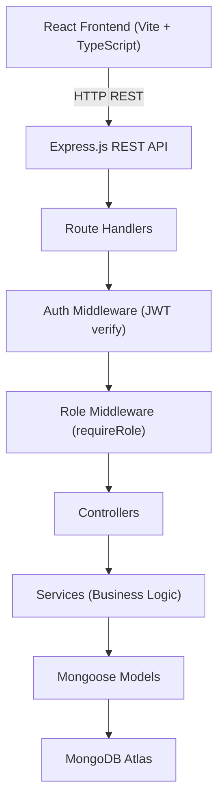
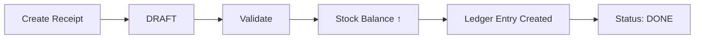
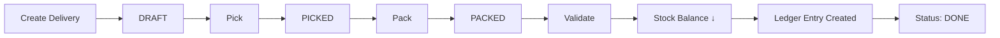
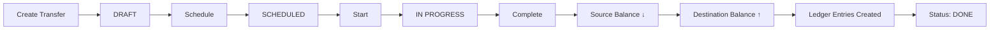
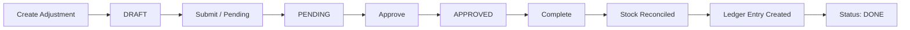

# 📦 StockSense

> **Odoo Hackathon 2026** — Modular Real-Time Inventory Management System

---

## 📋 Table of Contents

1. [Project Overview](#project-overview)
2. [Why StockSense?](#why-stocksense)
3. [Problem Statement](#problem-statement)
4. [Solution](#solution)
5. [Key Features](#key-features)
6. [User Roles](#user-roles)
7. [Technology Stack](#technology-stack)
8. [System Architecture](#system-architecture)
9. [Inventory Workflow](#inventory-workflow)
10. [Project Structure](#project-structure)
11. [Installation & Setup](#installation--setup)
12. [Environment Variables](#environment-variables)
13. [Demo Credentials](#demo-credentials)
14. [API Overview](#api-overview)
15. [Security & Authorization](#security--authorization)
16. [Stock Ledger](#stock-ledger)
17. [Future Scope](#future-scope)
18. [Team](#team)
19. [License](#license)

---

## Project Overview

**StockSense** is a full-stack, modular inventory management system built for the **Odoo Hackathon 2026**. It provides businesses with a centralized platform to manage stock across multiple warehouses and locations — covering receipts, deliveries, internal transfers, and inventory adjustments — all backed by a complete, immutable stock movement ledger.

---

## Why StockSense?

Manual spreadsheets and disconnected registers create blind spots in inventory. StockSense replaces them with:

- **Centralized real-time stock visibility** across all warehouses and locations.
- **End-to-end traceability** — every stock-changing operation is recorded in the Stock Ledger, creating a permanent audit trail.
- **Role-based access control** that enforces business rules at the API level, ensuring only authorized personnel can validate or modify inventory.
- **A clean, workflow-driven UI** that guides warehouse staff and managers through standard inventory operations without ambiguity.

---

## Problem Statement

Businesses managing inventory across multiple warehouses often rely on:

- Manual registers and physical count sheets.
- Disconnected spreadsheets with no real-time sync.
- No traceable history of who changed what, when, and why.
- No enforcement of business rules (e.g., stock cannot go negative).
- No single source of truth for current stock levels.

This results in stock discrepancies, delayed operations, and costly errors.

---

## Solution

StockSense provides a structured, backend-validated inventory system where:

- Stock is tracked by **product × location**, not as a single aggregate number.
- Every receipt, delivery, transfer, and adjustment goes through a **defined lifecycle** (e.g., Draft → Done).
- Stock balances are **only updated by the backend** at the point of validation/completion.
- Every stock movement creates an immutable **Stock Ledger entry** for full traceability.
- Role-based authorization ensures only **Inventory Managers** can perform stock-changing operations.

---

## Key Features

### 🔐 Authentication
- User login with email and password.
- JWT-based session management.
- Role-based authorization (Inventory Manager / Warehouse Staff).
- Secure token storage and session restoration on page refresh.

### 📊 Dashboard
- Real-time KPIs: Total Products, Low Stock, Out of Stock.
- Operational summary: Pending Receipts, Pending Deliveries, Scheduled Transfers.
- Warehouse and category filtering.
- Stock distribution chart powered by Recharts.

### 📦 Product Management
- Create products with name, SKU/code, category, unit of measurement, and reorder level.
- Optional initial stock assignment to a specific warehouse and location.
- Reorder level alerts for low stock.

### 🚚 Receipts (Inbound)
- Create receipts with supplier, warehouse, destination location, and line items.
- Lifecycle: **Draft → Done (Validated)**.
- Stock increases **only on validation**.
- Ledger entry created on validation.

### 📤 Delivery Orders (Outbound)
- Create delivery orders with customer, warehouse, source location, and line items.
- Lifecycle: **Draft → Picked → Packed → Done (Validated)**.
- Strict stock availability check before validation.
- Stock decreases **only on validation**.
- Ledger entry created on validation.

### 🔄 Internal Transfers
- Transfer stock between warehouses or locations.
- Lifecycle: **Draft → Scheduled → In Progress → Done (Completed)**.
- Source stock decreases and destination stock increases on completion.
- Ledger entries created for both source and destination.

### 🗂️ Inventory Adjustments
- Reconcile physical count with system stock.
- Enter counted quantity; system calculates the difference.
- Lifecycle: **Draft → Pending (Submitted) → Approved → Done (Completed)**.
- Stock balance is updated **only on completion**.
- Adjustment is recorded in the ledger.

### 📜 Stock Ledger / Move History
- Complete, searchable history of all inventory movements.
- Movement types: Receipt, Delivery, Transfer In, Transfer Out, Adjustment, Initial Stock.
- Shows previous quantity, new quantity, reference, warehouse, location, and operator.
- Filter by product, operation type, warehouse, location, reference, and date.

### 🏭 Warehouse & Location Management
- Create and manage multiple warehouses.
- Create locations within warehouses.
- Location-based stock tracking (StockBalance per product × location).

---

## User Roles

| Capability | Inventory Manager | Warehouse Staff |
|---|:---:|:---:|
| Login | ✅ | ✅ |
| View Dashboard | ✅ | ✅ |
| View Products | ✅ | ✅ |
| Create Products | ✅ | ❌ |
| View Receipts | ✅ | ✅ |
| Create Receipts | ✅ | ❌ |
| Validate Receipts | ✅ | ❌ |
| View Delivery Orders | ✅ | ✅ |
| Create Delivery Orders | ✅ | ❌ |
| Pick / Pack / Validate Deliveries | ✅ | ❌ |
| View Internal Transfers | ✅ | ✅ |
| Create / Complete Transfers | ✅ | ❌ |
| View Inventory Adjustments | ✅ | ✅ |
| Create / Approve / Complete Adjustments | ✅ | ❌ |
| View Move History | ✅ | ✅ |
| Manage Warehouses & Locations | ✅ | ❌ |

> **Note:** Role enforcement is applied at the **API level** via backend middleware. The frontend also conditionally renders action buttons based on role, but security is never delegated solely to the client.

---

## Technology Stack

### Frontend
| Technology | Purpose |
|---|---|
| React 18 | UI component framework |
| TypeScript | Type-safe development |
| Vite | Build tool and dev server |
| Tailwind CSS | Utility-first styling |
| Recharts | Dashboard data visualization |

### Backend
| Technology | Purpose |
|---|---|
| Node.js | JavaScript runtime |
| Express.js | REST API framework |
| Mongoose | MongoDB ODM |
| JSON Web Tokens (JWT) | Authentication tokens |
| bcryptjs | Password hashing |

### Database
| Technology | Purpose |
|---|---|
| MongoDB Atlas | Cloud-hosted NoSQL database |

---

## System Architecture



### Key Design Decisions

- **Services layer** encapsulates all business logic (stock validation, ledger writes, transactions) — controllers stay thin.
- **StockBalance** is a separate collection tracking quantity per `product × location × warehouse`. Products do **not** store stock directly.
- **StockLedger** is an append-only collection — records are created but never updated or deleted.
- Stock-changing database operations use **MongoDB sessions/transactions** to ensure atomicity.

---

## Inventory Workflow

### 📥 Receipt Flow


### 📤 Delivery Flow


### 🔄 Internal Transfer Flow


### 🗂️ Adjustment Flow


---

## Project Structure

```
StockSense/
├── client/                        # React + TypeScript frontend
│   ├── public/
│   └── src/
│       ├── components/            # Reusable UI components
│       ├── pages/                 # Page-level components
│       ├── services/              # API service layer (apiClient, authService, etc.)
│       ├── hooks/                 # Custom React hooks
│       ├── context/               # React context providers
│       └── App.tsx                # Root component and client-side router
│
├── server/                        # Node.js + Express backend
│   ├── config/                    # Database connection and configuration
│   ├── controllers/               # Route handler functions
│   ├── middleware/                # Auth and role middleware
│   ├── models/                    # Mongoose schemas (Product, StockBalance, StockLedger, etc.)
│   ├── routes/                    # Express route definitions
│   ├── services/                  # Business logic layer
│   ├── utils/                     # Shared utilities and helpers
│   ├── seed/                      # Database seed scripts (demo users, sample data)
│   ├── app.js                     # Express app setup
│   └── server.js                  # Server entry point
│
└── README.md
```

---

## Installation & Setup

### Prerequisites
- Node.js ≥ 18
- npm ≥ 9
- A MongoDB Atlas account (or local MongoDB instance)

---

### Backend Setup

```bash
# 1. Navigate to the server directory
cd server

# 2. Install dependencies
npm install

# 3. Create and configure your environment file
cp .env.example .env
# Edit .env with your values (see Environment Variables section)

# 4. (Optional) Seed the database with demo data
node seed/seed.js

# 5. Start the backend server
npm run dev
```

The backend API will be available at `http://localhost:5000`.

---

### Frontend Setup

```bash
# 1. Navigate to the client directory
cd client

# 2. Install dependencies
npm install

# 3. (Optional) Configure the API URL if your backend is not on port 5000
# Create a .env file in /client with:
# VITE_API_URL=http://localhost:5000/api

# 4. Start the frontend dev server
npm run dev
```

The frontend will be available at `http://localhost:5173`.

---

## Environment Variables

### Server (`server/.env`)

```env
# MongoDB connection string
MONGODB_URI=mongodb+srv://<username>:<password>@<cluster>.mongodb.net/<dbname>

# JWT secret key — use a long, random string in production
JWT_SECRET=your_jwt_secret_key_here

# JWT token expiration
JWT_EXPIRES_IN=7d

# Port for the Express server
PORT=5000

# Node environment
NODE_ENV=development
```

> ⚠️ **Never commit real secrets, passwords, or connection strings to version control.**

### Client (`client/.env`) — Optional

```env
# Override if the backend runs on a different host or port
VITE_API_URL=http://localhost:5000/api
```

---

## Demo Credentials

> 🔐 These are **demo-only** credentials created by the seed script for evaluation purposes.

| Role | Email | Password |
|---|---|---|
| Inventory Manager | `manager@stocksense.demo` | `Demo@12345` |
| Warehouse Staff | `staff@stocksense.demo` | `Demo@12345` |

**Inventory Manager** has full access to create, validate, and complete all inventory operations.

**Warehouse Staff** has read-only access — they can view all pages but cannot perform any stock-changing operations.

---

## API Overview

All endpoints are prefixed with `/api` and require a valid JWT (`Authorization: Bearer <token>`) except `/api/auth/login`.

| API Group | Description |
|---|---|
| `/api/auth` | User login, JWT issuance, and authenticated user info (`/me`) |
| `/api/products` | Product catalog — create, list, update, delete |
| `/api/categories` | Product categories — create, list |
| `/api/warehouses` | Warehouse management — create, list, update, soft-delete |
| `/api/locations` | Warehouse location management — create, list, update, soft-delete |
| `/api/receipts` | Inbound receipts — lifecycle from Draft to Done (validate) |
| `/api/delivery-orders` | Outbound deliveries — lifecycle from Draft through Pick, Pack, to Done |
| `/api/internal-transfers` | Stock transfers — lifecycle from Draft through Schedule, Start, to Done |
| `/api/stock-adjustments` | Inventory adjustments — lifecycle from Draft through Approve to Done |
| `/api/stock-ledger` | Read-only — query the full stock movement history |
| `/api/dashboard` | Aggregated KPI data for the dashboard |

---

## Security & Authorization

### Authentication
- Passwords are hashed using **bcryptjs** before storage.
- On login, the server issues a signed **JWT** containing the user's ID and role.
- All protected routes pass through `authMiddleware`, which verifies the JWT and attaches the user to the request.

### Role-Based Authorization
- A `requireRole('inventory_manager')` middleware guards all mutating endpoints.
- This middleware runs **after** authentication and rejects any request from a `warehouse_staff` user with `HTTP 403 Forbidden`.
- The frontend conditionally renders action buttons based on the authenticated user's role, but this is a UX enhancement only — security is enforced solely by the backend.

### Protected Operations (Inventory Manager Only)
- Creating, updating, or deleting Products, Warehouses, and Locations.
- Creating Receipts and Validating them.
- Creating Delivery Orders and performing Pick, Pack, Validate.
- Creating, Scheduling, Starting, and Completing Internal Transfers.
- Creating, Approving, and Completing Inventory Adjustments.

---

## Stock Ledger

The **Stock Ledger** (`/api/stock-ledger`) is the audit backbone of StockSense.

### How it works

Every stock-changing operation in the backend creates a `StockLedger` document as part of the same atomic operation. This record is **never modified or deleted** after creation.

Each ledger entry captures:

| Field | Description |
|---|---|
| `transactionNumber` | Unique auto-generated reference |
| `operationType` | `RECEIPT`, `DELIVERY`, `TRANSFER_IN`, `TRANSFER_OUT`, `ADJUSTMENT`, `INITIAL_STOCK` |
| `product` | The product affected |
| `warehouse` | The warehouse involved |
| `location` | The specific location |
| `previousQuantity` | Stock level before the operation |
| `newQuantity` | Stock level after the operation |
| `quantity` | The quantity moved |
| `referenceNumber` | The source document number (receipt, delivery, etc.) |
| `performedBy` | The user who performed the action |
| `createdAt` | Timestamp of the movement |

### Why this matters
- Provides a complete, tamper-evident audit trail.
- Enables reconstruction of stock levels at any point in time.
- Satisfies compliance and traceability requirements.
- Helps identify discrepancies between expected and actual stock.

---

## Future Scope

> The following features are **not currently implemented** and are planned for future development:

- 📊 **Advanced Reporting** — exportable stock movement reports, period-based summaries, and reorder alerts.
- 📧 **Notifications** — email or in-app alerts for low stock, pending approvals, and scheduled transfers.
- 🔍 **Advanced Search & Filters** — full-text search and saved filter presets across all pages.
- 📱 **Mobile-Responsive UI** — fully optimized mobile layout for warehouse floor operations.
- 🏷️ **Barcode / QR Code Support** — scan-to-receive and scan-to-pick workflows.
- 🌐 **Multi-Tenancy** — support for multiple organizations within a single deployment.
- 🤖 **Demand Forecasting** — AI-assisted stock level recommendations based on movement history.
- 🔗 **Third-party Integrations** — ERP, accounting, and e-commerce platform connectors.
- 🔄 **CI/CD Pipeline** — automated testing and deployment workflows.

---

## Team

| Name | Role |
|---|---|
| *(Team Member 1)* | *(Role)* |
| *(Team Member 2)* | *(Role)* |
| *(Team Member 3)* | *(Role)* |

> Built with ❤️ for **Odoo Hackathon 2026**.

---

## License

This project is licensed under the **MIT License**.

```
MIT License

Copyright (c) 2026 StockSense Team

Permission is hereby granted, free of charge, to any person obtaining a copy
of this software and associated documentation files (the "Software"), to deal
in the Software without restriction, including without limitation the rights
to use, copy, modify, merge, publish, distribute, sublicense, and/or sell
copies of the Software, and to permit persons to whom the Software is
furnished to do so, subject to the following conditions:

The above copyright notice and this permission notice shall be included in all
copies or substantial portions of the Software.

THE SOFTWARE IS PROVIDED "AS IS", WITHOUT WARRANTY OF ANY KIND, EXPRESS OR
IMPLIED, INCLUDING BUT NOT LIMITED TO THE WARRANTIES OF MERCHANTABILITY,
FITNESS FOR A PARTICULAR PURPOSE AND NONINFRINGEMENT. IN NO EVENT SHALL THE
AUTHORS OR COPYRIGHT HOLDERS BE LIABLE FOR ANY CLAIM, DAMAGES OR OTHER
LIABILITY, WHETHER IN AN ACTION OF CONTRACT, TORT OR OTHERWISE, ARISING FROM,
OUT OF OR IN CONNECTION WITH THE SOFTWARE OR THE USE OR OTHER DEALINGS IN THE
SOFTWARE.
```

---

<div align="center">
  <strong>StockSense</strong> — Real-Time Inventory Management · Odoo Hackathon 2026
</div>
